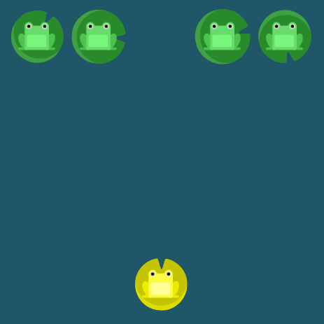

# Flexbox Froggy / Flexbox Exercises
URL: `https://flexboxfroggy.com/#es`.


### NIVEL 1 ###

Bienvenido a Flexbox Froggy, un juego donde ayudarás a Froggy y a sus amigos escribiendo código CSS. Guía a esta rana hacia la hoja de lirio en la derecha, usando la propiedad `justify-content`, la cual alinea elementos horizontalmente y acepta los siguientes valores:

`flex-start`: Alinea elementos al lado izquierdo del contenedor.
`flex-end`: Alinea elementos al lado derecho del contenedor.
`center`: Alinea elementos en el centro del contenedor.
`space-between`: Muestra elementos con la misma distancia entre ellos.
`space-around`: Muestra elementos con la misma separación alrededor de ellos.

Por ejemplo, `justify-content: flex-end;` moverá la rana a la derecha.


```css
#pond {
  display: flex;
  justify-content: flex-end;
}
```

### NIVEL 2 ###

Nuevamente, utiliza `justify-content` para ayudar a esas ranas a llegar a sus hojas de lirio. Recuerda que esta propiedad CSS alinea elementos horizontalmente y acepta los siguientes valores:

`flex-start`: Alinea elementos al lado izquierdo del contenedor.
`flex-end`: Alinea elementos al lado derecho del contenedor.
`center`: Alinea elementos en el centro del contenedor.
`space-between`: Muestra elementos con la misma distancia entre ellos.
`space-around`: Muestra elementos con la misma separación alrededor de ellos.


```css
#pond {
  display: flex;
  justify-content: center;
}
```

### NIVEL 3 ###

Ayuda a las tres ranas a encontrar sus hojas de lirio usando `justify-content`. En esta oportunidad, las hojas de lirio tienen mucho espacio a su alrededor.

Si no recuerdas los valores de una propiedad, puedes pasar el cursor sobre el nombre de una e inmediatamente se mostrarán. Prueba pasando el cursor sobre `justify-content`.


```css
#pond {
  display: flex;
  justify-content: space-around;
}
```

### NIVEL 4 ###

Ahora las hojas de lirio de los bordes se han desplazado a un costado, aumentando así el espacio entre ellas. Usa `justify-content`. En esta oportunidad, las hojas de lirio tienen el mismo espacio entre ellas.


```css
#pond {
  display: flex;
  justify-content: space-between;
}
```

### NIVEL 5 ###

Ahora usa align-items para ayudar a las ranas a llegar al fondo del estanque. Esta propiedad CSS alinea elementos verticalmente y acepta los siguientes valores:

`flex-start`: Alinea elementos a la parte superior del contenedor.
`flex-end`: Alinea elementos a la parte inferior del contenedor.
`center`: Alinea elementos en el centro (verticalmente hablando) del contenedor.
`baseline`: Muestra elementos en la línea base del contenedor
`stretch`: Elementos se estiran para ajustarse al contenedor.


```css
#pond {
  display: flex;
  align-items: flex-end;
}
```

### NIVEL 6 ###

Mueve la rana al centro del estanque, usando una combinación de `justify-content` y `align-items`.


```css
#pond {
  display: flex;
  justify-content: center;
  align-items: center;
}
```

### NIVEL 7 ###

Nuevamente, las ranas necesitan cruzar el estanque. En esta oportunidad, las hojas de lirio tienen mucho espacio alrededor de ellas. Debes usar una combinación de `justify-content` y `align-items`.


```css
#pond {
  display: flex;
  justify-content: space-around;
  align-items: flex-end;
}
```

### NIVEL 8 ###

Las ranas necesitan ponerse en el mismo orden que sus hojas de lirio usando `flex-direction`. Esta propiedad CSS define la dirección de los elementos en el contenedor, y acepta los siguientes valores:

`row`: Elementos son colocados en la misma dirección del texto.
`row-reverse`: Elementos son colocados en la dirección opuesta al texto.
`column`: Elementos se colocan de arriba hacia abajo.
`column-reverse`: Elementos se colocan de abajo hacia arriba.


```css
#pond {
  display: flex;
  flex-direction: row-reverse;
}
```

### NIVEL 9 ###

Ayuda a las ranas a encontrar su hoja de lirio en la columna usando `flex-direction`. Esta propiedad CSS define la dirección de los elementos en el contenedor, y acepta los siguientes valores:

`row`: Elementos son colocados en la misma dirección del texto.
`row-reverse`: Elementos son colocados en la dirección opuesta al texto.
`column`: Elementos se colocan de arriba hacia abajo.
`column-reverse`: Elementos se colocan de abajo hacia arriba.


```css
#pond {
  display: flex;
  flex-direction: column;
}
```

### NIVEL 10 ###

Ayuda a las ranas a llegar a sus hojas de lirio. A pesar de que ellas parecen estar cerca, necesitarás usar `flex-direction` y `justify-content` para llegar hasta allí.

Nota que cuando estableces la dirección a una fila invertida o columna, el inicio y el final también se invierten.


```css
#pond {
  display: flex;
  justify-content: flex-end;
  flex-direction: row-reverse;
}
```

### NIVEL 11 ###

Ayuda a las ranas a encontrar sus hojas de lirio usando `flex-direction` y `justify-content`.

Nota que cuando es una columna, `justify-content` cambia a vertical y `align-items` a horizontal.


```css
#pond {
  display: flex;
  flex-direction: column;
  justify-content: flex-end;
}
```

### NIVEL 12 ###

Ayuda a las ranas a encontrar sus hojas de lirio usando `flex-direction` y `justify-content`.


```css
#pond {
  display: flex;
  flex-direction: column-reverse;
  justify-content: space-between;
}
```

### NIVEL 13 ###

Ayuda a las ranas a encontrar sus hojas de lirio usando `flex-direction`, `justify-content`, y `align-items`.


```css
#pond {
  display: flex;
  justify-content: center;
  flex-direction: row-reverse;
  align-items: flex-end;
}
```

### NIVEL 14 ###

A veces, invertir el orden de una fila o columna de un contenedor no es suficiente. En esos casos, nosotros podemos aplicar la propiedad `order` a elementos individuales. Por defecto, los elementos tienen un valor 0, pero nosotros podemos usar esta propiedad para establecerlo a un número entero positivo o negativo.

Usa la propiedad `order` para reordenar las ranas de acuerdo a sus hojas de lirio.


```css
#pond {
  display: flex;
}

.yellow {
  order: 1;
}
```

### NIVEL 15 ###

Usa la propiedad `order` para enviar la rana de color rojo a su hoja de lirio.


```css
#pond {
  display: flex;
}

.red {
  order: -1;
}
```

### NIVEL 16 ###

Otra propiedad que puedes aplicar a elementos individuales es `align-self`. Esta propiedad acepta los mismos valores de `align-items` y sus valores son usados para un elemento específico



```css
#pond {
  display: flex;
  align-items: flex-start;
}

.yellow {
  align-self: flex-end;
}
```

### NIVEL 17 ###

Combina order con `align-self` para ayudar a las ranas a llegar a sus destinos.


```css
#pond {
  display: flex;
  align-items: flex-start;
}

.yellow {
  order: 1;
  align-self: flex-end;
}
```

### NIVEL 18 ###

¡Oh, no! Todas las ranas están apretadas en una sola fila de hojas de lirio. Manos a la obra, vamos a distribuirlas correctamente usando la propiedad `flex-wrap`, la cual acepta los siguientes valores:

`nowrap`: Cada elemento se ajusta en una sola línea.
`wrap`: los elementos se envuelven alrededor de líneas adicionales.
`wrap-reverse`: Los elementos se envuelven alrededor de líneas adicionales en reversa.


```css
#pond {
  display: flex;
  flex-wrap: wrap;
}
```

### NIVEL 19 ###

Ayuda a este ejército de ranas a ordenarse en tres columnas usando una combinación de `flex-direction` y `flex-wrap`.


```css
#pond {
  display: flex;
  flex-direction: column;
  flex-wrap: wrap;
}
```

### NIVEL 20 ###

Las dos propiedades `flex-direction` y `flex-wrap` son usadas a menudo en conjunto con la propiedad abreviada `flex-flow`, la cual fue creada para combinarlas. Esta propiedad abreviada, acepta un valor de cada una separada por un espacio.

Por ejemplo, puedes usar `flex-flow` para establecer filas y envolverlas.

Trata de usar `flex-flow` para volver a realizar el nivel anterior.


```css
#pond {
  display: flex;
  flex-flow: column wrap;
}
```

### NIVEL 21 ###

Las ranas están repartidas por todo el estanque, pero las hojas de lirio están agrupadas en la parte superior. Puedes usar `align-content` para establecer como múltiples líneas están separadas una de otra. Esta propiedad acepta los siguientes valores:

`flex-start`: Las líneas se posicionan en la parte superior del contenedor.
`flex-end`: Las líneas se posicionan en la parte inferior del contenedor.
`center`: Las líneas se posicionan en el centro (verticalmente hablando) del contenedor.
`space-between`: Las líneas se muestran con la misma distancia entre ellas.
`space-around`: Las líneas se muestran con la misma separación alrededor de ellas.
`stretch`: Las líneas se estiran para ajustarse al contenedor.

Esto puede ser confuso, pero `align-content` determina el espacio entre las líneas, mientras que align-items determina como los elementos en su conjunto están alineados dentro del contenedor. Cuando hay solo una línea, `align-content` no tiene efecto.


```css
#pond {
  display: flex;
  flex-wrap: wrap;
  align-content: flex-start;
}
```

### NIVEL 22 ###

Ahora, la corriente ha agrupado las hojas de lirio en la parte inferior. Usa `align-content` para guiar las ranas hasta allí.


```css
#pond {
  display: flex;
  flex-wrap: wrap;
  align-content: flex-end;
}
```

### NIVEL 23 ###

Las ranas han tenido una fiesta, pero es momento de volver a casa. Usa una combinación de `flex-direction` y `align-content` para llevarlas a sus hojas de lirio.


```css
#pond {
  display: flex;
  flex-wrap: wrap;
  flex-direction: column-reverse;
  align-content: center;
}
```

### NIVEL 24 ###

Trae a las ranas a su casa una vez más usando las propiedades CSS que aprendiste:

`justify-content`
`align-items`
`flex-direction`
`order`
`align-self`
`flex-wrap`
`flex-flow`
`align-content`


```css
#pond {
  display: flex;
  justify-content: center;
  align-items: center;
  flex-direction: column-reverse;
  flex-wrap: wrap-reverse;
  align-content: space-between;
}
```

### COMPLETE ###

¡Tú ganas! gracias a tu dominio de flexbox, fuiste capaz de ayudar a todas las ranas a ir a sus hojas de lirio. ¡Basta mirar lo felices que son!

Si te pareció divertido, revisa otros proyectos en mi blog o Twitter y asegúrate de compartir Flexbox Froggy con tus amigos.

Twitter: https://twitter.com/thomashpark
Blog: https://thomaspark.co/

